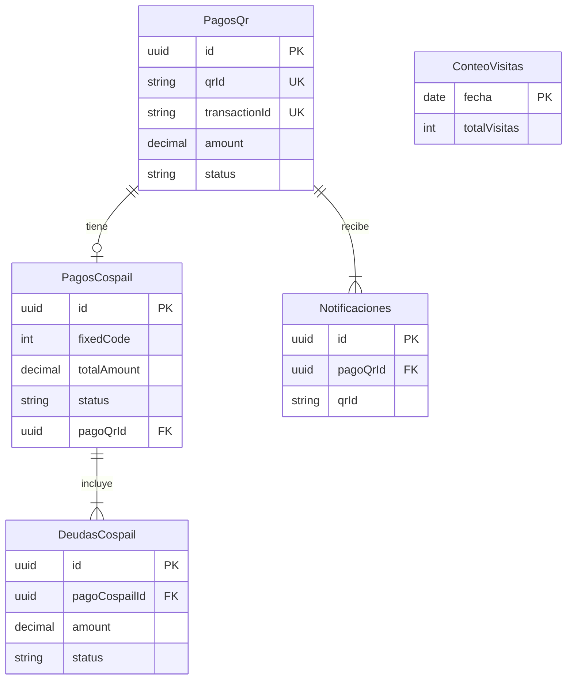

# Diagrama Entidad-Relación — Cospail Payments

> Fuente: `src/Domain/Entities/*` + `src/Infrastructure/Persistence/Configurations/*`
> Nota Mermaid: se usan nombres sin `snake_case` y claves simples (`PK`/`FK`/`UK`) porque el parser no acepta `pago_qr_id` ni `FK_UK`.

Tabla real ↔ entidad del diagrama:

| Diagrama | Tabla real |
|---|---|
| `PagosQr` | `pagos_qr` |
| `PagosCospail` | `pagos_cospail` |
| `DeudasCospail` | `deudas_cospail` |
| `Notificaciones` | `notificaciones_pago_qr` |
| `ConteoVisitas` | `conteo_visitas_diario` (aislada, sin FK) |

## Llaves

### PK (primarias)

* `pagos_qr.id` (`PagoQrConfiguration.cs:16`)
* `pagos_cospail.id` (`PagoCospailConfiguration.cs:16`)
* `deudas_cospail.id` (`DeudaCospailConfiguration.cs:16`)
* `notificaciones_pago_qr.id` (`NotificacionPagoQrConfiguration.cs:16`)
* `conteo_visitas_diario.fecha` (`ConteoVisitasDiarioConfiguration.cs:16`)

### FK (foráneas)

* `pagos_cospail.pago_qr_id -> pagos_qr.id`, nullable, `Restrict` (`PagoCospailConfiguration.cs:27-32`)
* `deudas_cospail.pago_cospail_id -> pagos_cospail.id`, `NOT NULL`, `Cascade` (`DeudaCospailConfiguration.cs:31-35`)
* `notificaciones_pago_qr.pago_qr_id -> pagos_qr.id`, `NOT NULL`, `Cascade` (`NotificacionPagoQrConfiguration.cs:34-39`)

### UK (únicas)

* `pagos_qr.transaction_id UNIQUE`, `pagos_qr.qr_id UNIQUE` (`PagoQrConfiguration.cs:32-33`)
* `pagos_cospail.pago_qr_id UNIQUE` (`PagoCospailConfiguration.cs:37`) — esto convierte la FK en 1 a 0..1.

## Cardinalidad en Mermaid

* `||` = exactamente 1, `o|` = 0 o 1, `}|` / `{` = 1 o muchos.
* `||--o|` = **1 a 1 opcional** (ej. `PagosQr` ↔ `PagosCospail`, vía `pago_qr_id UNIQUE + nullable`).
* `||--|{` = **1 a N** (ej. `PagosCospail` → `DeudasCospail`, `PagosQr` → `Notificaciones`).
* `}o--o{` = **N a M** (requiere tabla intermedia; aquí no hay ningún caso).

## Decisión: `pago_qr_id` vs `qr_id`

* `PagoQr.Id` (uuid interno) = PK estable, es lo que referencia `pagos_cospail.pago_qr_id`. Correcto como FK.
* `PagoQr.QrId` (string del banco) = clave natural externa, `UNIQUE` para búsqueda (webhook llega con `qrId`/`transactionId`), pero no debe ser FK: es ancha, externa y el pago nace `Pendiente` sin QR (`PagoCospail.cs:44,104-115`).

## Los 3 IDs de `pagos_qr`: por qué están bien

`pagos_qr` tiene 3 identificadores con dueño distinto, ninguno sobra:

| Columna | Quién lo genera | Cuándo | Uso |
|---|---|---|---|
| `id` (uuid v7, PK) | Nosotros (`NewId.V7()`, `PagoQr.cs:101`) | Al persistir el QR | FKs internas: `pagos_cospail.pago_qr_id`, `notificaciones_pago_qr.pago_qr_id`. Joins y relaciones. |
| `transaction_id` (string, UNIQUE) | Nosotros (`NewId.V7().ToString("N")`, `BancoEconomicoService.cs:279`) | Antes de llamar a `generateQR` | Requerido por el banco en `generateQR` (`BancoEconomicoQrClient.cs:88`). Idempotencia/traza **saliente**. |
| `qr_id` (string, UNIQUE) | Banco Económico (`GenerateQrResponseDto.QrId`) | Respuesta de `generateQR` (`BancoEconomicoService.cs:87`) | Clave de negocio para `annulQR`, `statusQR/{qrId}`, `paidQR` y lookup del webhook (`SingleOrDefault(x => x.QrId == ...)`, `BancoEconomicoService.cs:367`). |

> **Ojo al conciliar:** `pagos_qr.transaction_id` (nuestro, 32 hex) **≠** `notificaciones_pago_qr.transaction_id` (el que el banco devuelve en el callback, ej. `18459506`). Son dos momentos distintos: saliente vs entrante. Ver test `WhenTransactionDiffersFromOurs_AcceptsBankTransactionId` (`BancoEconomicoServiceTests.cs:170`). No compararlos como iguales.
